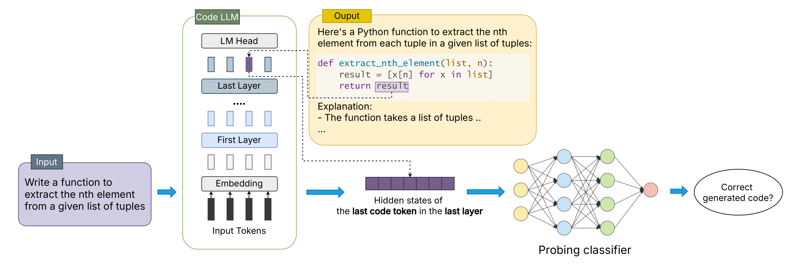

<div align="center">

# OPENIA: Correctness Assessment of Code Generated by Large Language Models Using Internal Representations
[](https://opensource.org/licenses/MIT) [](https://www.python.org/downloads/release/python-380/) [](https://arxiv.org/abs/2501.12934)
</div>

## Introduction

In this paper, we introduce OPENIA, a novel white-box (open-box) framework that leverages these internal representations to assess the correctness of LLM-generated code. OPENIA systematically analyzes the intermediate states of representative opensource LLMs specialized for code, including DeepSeek-Coder,CodeLlama, and MagicCoder, across diverse code generation benchmarks.

Experimental results demonstrate that OPENIA consistently outperforms baseline models, achieving higher accuracy, precision, recall, and F1Scores with up to a 2X improvement in standalone code generation and a 46% enhancement in repository-specific scenarios. By unlocking the potential of in-process signals, OPENIA paves the way for more proactive and efficient quality assurance mechanisms in LLM-assisted code generation.

#### Paper: https://arxiv.org/abs/2501.12934

## The architecture


In RAMBO, procedure retrieve consists of two main steps,
*Essential Code Element Identification (EEI)* and *Relevant Usage Extraction (RUE)*. For the given infilling method m in repo R, *EEI* identifies the repo-specific essential code elements (e.g., methods, attributes, or types) as “materials” to form m’s body. After that, *RUE* extracts these elements’ usages (i.e., the methods using those elements)
as “recipes” of these materials to form the method body
and then ranks these usages based on the relevancy to m. Then, the identified essential elements and their relevant usages are utilized to construct the context before feeding it into a CodeLLM to generate method body.

# Project Overview

# Quickstart
## Download dataset

[Download full repository here](https://www.dropbox.com/scl/fo/zgn1s3ad8lhxwi4n8pn06/AHQ2o8AzYIFpCLIIyYuoH48?rlkey=cx1emxzccyhurcajva5a6gnrg&st=zk5qdsn7&dl=0)

## Prepare Environment
First, we should set up a python environment. This code base has been tested under python 3.8.

```bash
$ conda create -n openia python=3.8
$ conda activate openia
$ pip install -r requirements.txt
```

# Citation
If you're using RAMBO in your research or applications, please consider citing our paper:
```bibtex
@article{bui2025correctness,
  title={Correctness Assessment of Code Generated by Large Language Models Using Internal Representations},
  author={Bui, Tuan-Dung and Vu, Thanh Trong and Nguyen, Thu-Trang and Nguyen, Son and Vo, Hieu Dinh},
  journal={arXiv preprint arXiv:2501.12934},
  year={2025}
}
```

# Contact us
If you have any questions, comments or suggestions, please do not hesitate to contact us.
- Email: 21020006@vnu.edu.vn

# License
[MIT License](LICENSE)